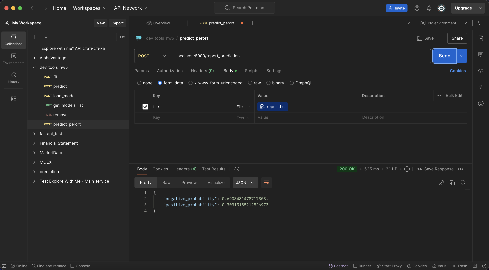
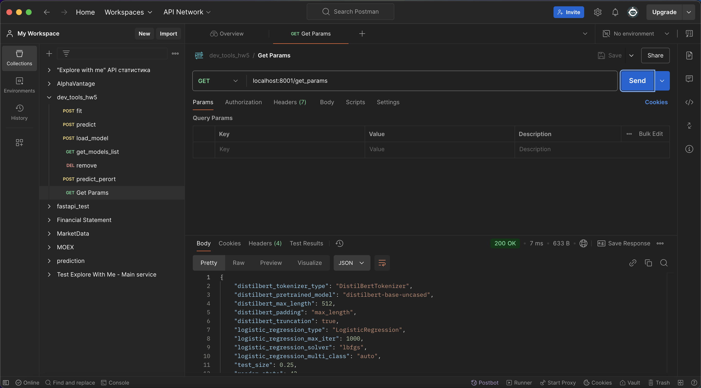
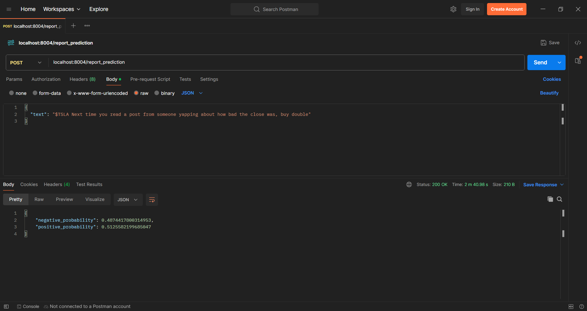
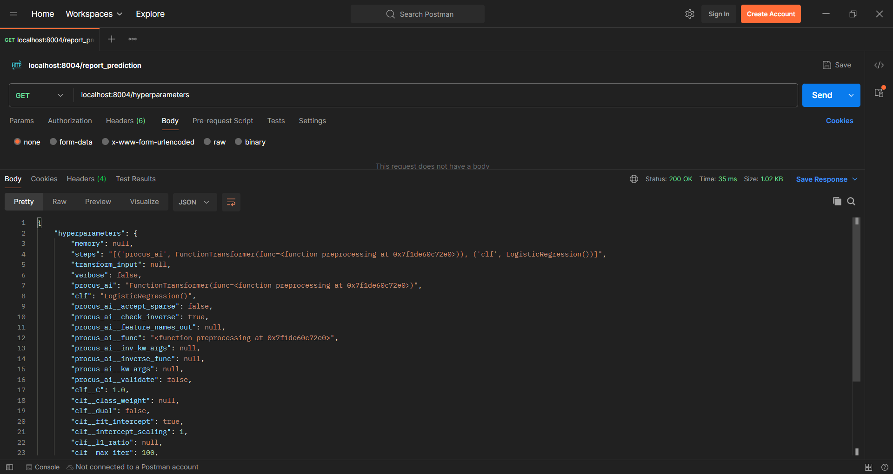

# 📈 Предсказание движения цен на фьючерсы на основе текстовых данных

## 🏆 AI YP'24 Команда 28

### 👩‍🏫 Куратор:
**Александра Ковалева**  
Telegram: [@ak0va](https://t.me/ak0va)

### 👥 Члены команды:
- **Рябцев В.И.**  
  Telegram: [@gamardjo6a](https://t.me/gamardjo6a)
- **Фазилов С.В.**  
  Telegram: [@dope777](https://t.me/dope777)
- **Хоменко П.М.**  
  Telegram: [@pavelmkhomenko](https://t.me/pavelmkhomenko)
- **Константинов А.О.**  
  Telegram: [@middernacht](https://t.me/middernacht)

---

## 📜 Описание проекта
Проект направлен на разработку модели машинного обучения для предсказания движения цен на фьючерсы различных компаний на основе текстовых данных.  

**Цель**:  
Анализировать текстовые данные для извлечения скрытых паттернов, которые могут влиять на финансовые рынки, и прогнозировать изменения цен.

---

## 🚀 Начало работы

1. Перейдите в директорию проекта:
    ```bash
    cd ./app
    ```
2. Запустите приложение:
    ```bash
    docker compose up --build
    ```
3. Откройте в браузере [http://localhost:8501/](http://localhost:8501/).

---

## 🔌 Порты приложения:

- **8501** - Streamlit
- **8001** - service_10k
- **8002** - service_news
- **8003** - service_reddit
- **8004** - service_twitter

---

### Демонстрация прогноза по отчетам 10-K

Приложение способно предсказывать вероятность, что акция покажет поведение лучше индекса или хуже индекса в течение 10 дней после публикации отчета. На вход подается часть отчета 10K Management discussion and analysis (MD&A). На выходе получаются вероятности того, что бумага будет лучше индекса или хуже индекса. Скриншоты работы API через Postman представлен ниже:



Также можно получить основные гиперпараметры трансформера и модели логистической регрессии. Также возвращается информация об участке текста, на котором выполнялось обучение




---

### Демонстрация прогноза по твитам

Приложение способно предсказывать динамику роста акции, упоминутой в твите, через день после публикации. На вход модель получает текст твита, на выходе модель возвращает вероятности двух событий: цена пойдет вверх или вниз. 



Приложение предоставляет возможность получить гиперпараметры обученной модели.




