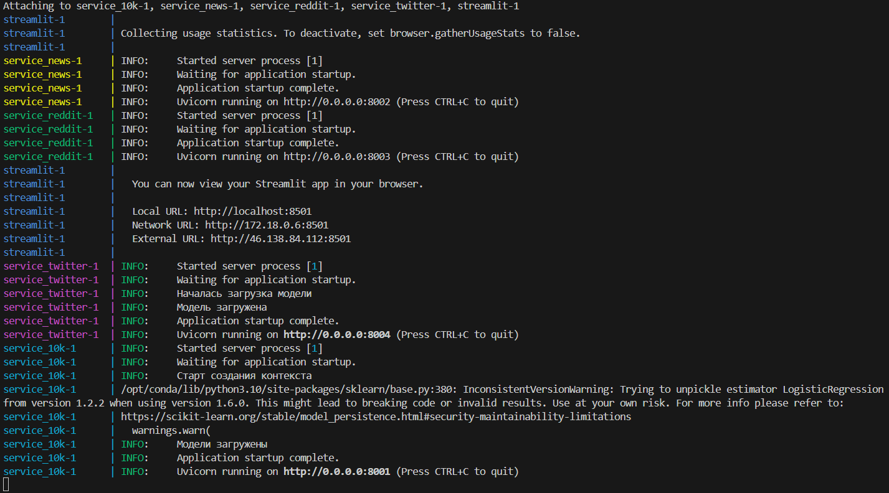
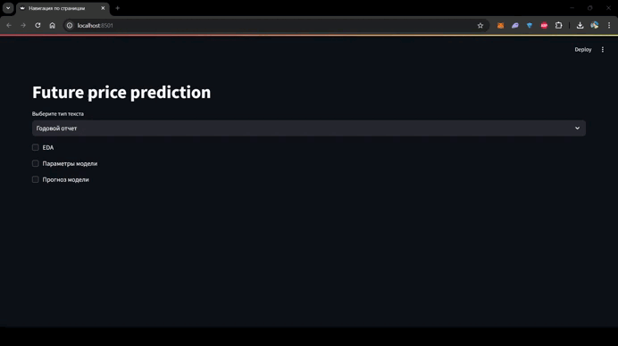

# Report

## Дерево проекта
```plaintext
.
├── LICENSE # Лицензия проекта
├── README.md # Общая информация о проекте и инструкция по сборке
├── app # Основное приложение
│   ├── docker-compose.yml # Конфигурация для сборки и запуска контейнеров
│   ├── logs # Логи работы сервисов
│   │   └── Log.log # Лог-файл общего назначения
│   ├── service_10k # Сервис для анализа отчетов формата 10-K
│   │   ├── app # FastAPI сервер
│   │   │   ├── __init__.py # Инициализация директории как модуля Python
│   │   │   ├── config.py # Конфигурация сервера
│   │   │   ├── entities.py # Pydantic-классы для валидации данных
│   │   │   ├── logs # Логи работы сервера
│   │   │   │   └── Log.log
│   │   │   ├── main.py # Точка входа в сервер
│   │   │   ├── model # Хранилище моделей для прогнозов
│   │   │   │   └── best_model_and_pca.pkl
│   │   │   └── service.py # Основные методы сервера
│   │   ├── dockerfile # Инструкция для сборки Docker-образа
│   │   └── requirements.txt # Список используемых Python-библиотек
│   ├── service_twitter # Сервис для анализа данных с Twitter
│   │   ├── app
│   │   │   ├── FinBert.py # Векторизация текста с помощью модели FinBERT
│   │   │   ├── __init__.py # Инициализация модуля
│   │   │   ├── config.py # Конфигурация сервера
│   │   │   ├── logs # Логи работы сервера
│   │   │   │   └── Log.log
│   │   │   ├── main.py # Точка входа в сервер
│   │   │   └── model # Хранилище моделей
│   │   ├── dockerfile # Инструкция для сборки Docker-образа
│   │   └── requirements.txt # Список используемых библиотек
│   └── streamlit # Интерфейс на Streamlit
│       ├── app
│       │   ├── __init__.py # Инициализация модуля
│       │   ├── app.py # Главный файл приложения Streamlit
│       │   ├── eda_10k # Визуализация EDA для отчетов 10-K
│       │   │   └── ROC_AUC.png
│       │   ├── eda_twitter # Визуализация EDA для данных Twitter
│       │   │   ├── roc_curve.png
│       │   │   ├── tweets_year.png
│       │   │   └── words_cloud.png
│       │   ├── page_10k # Страница для анализа отчетов 10-K
│       │   │   ├── 10k.py # Логика страницы
│       │   │   ├── __init__.py # Инициализация модуля
│       │   │   └── final.csv # Датасет, для демонстрации EDA
│       │   └── page_twitter # Страница для анализа данных с Twitter
│       │       ├── __init__.py # Инициализация модуля
│       │       ├── final.csv # Датасет, использованный для обучения модели
│       │       └── twitter.py # Логика страницы
│       ├── dockerfile # Инструкция для сборки Docker-образа
│       └── requirements.txt # Список используемых библиотек
├── docs # Документация проекта
│   ├── checkpoint.md # Первый чекпоинт
│   ├── presentation.pdf # Презентация проекта
│   ├── report.md # Основная документация
│   ├── gifs # Демонстрационные GIF-файлы
│   │   ├── 10_k.gif
│   │   └── twitter.gif
│   └── images # Изображения для документации
│       ├── image-1.png
│       ├── image-2.png
│       ├── image-3.png
│       ├── image-4.png
│       └── image-5.png
├── ds # Data Science компонент
│   ├── 10k_reports # Исследования отчетов 10-K
│   │   ├── models # Обученные модели
│   │   │   ├── lrm.joblib
│   │   │   ├── meta_model.pkl
│   │   │   ├── model_lgb.pkl
│   │   │   └── model_rf.pkl
│   │   └── notebooks # Jupyter ноутбуки
│   │       └── 10_K_non_linear_staking.ipynb
│   └── twitter # Исследования данных Twitter
│       ├── data # Данные для анализа
│       │   ├── preprocessed.csv
│       │   ├── processed.csv
│       │   └── raw.csv
│       ├── models # Обученные модели
│       │   ├── bow-logreg.pickle
│       │   ├── bow-pca-lgbm.pickle
│       │   └── tfidf-logreg.pickle
│       ├── notebooks # Jupyter ноутбуки
│       │   ├── eda.ipynb
│       │   ├── fastText_pretrained.ipynb
│       │   ├── ml_methods.ipynb
│       │   ├── preprocessing.ipynb
│       │   ├── tune_finbert.ipynb
│       │   └── w2v(new).ipynb
│       └── pipelines # Пайплайны обработки данных
│           ├── __init__.py
│           └── tokenizers.py
├── lint # Инструменты проверки кода
│   ├── check_py.sh # Скрипт для проверки скриптов python по pycodestyle.py, flake8 и pylint
│   └── pycodestyle.py # Проверка Python-скриптов на соответствие кодстайлу
├── load_reports # Модуль загрузки отчетов
│   ├── __init__.py
│   ├── data_classes.py # Классы данных
│   ├── main.py # Основной модуль
│   ├── reports_client.py # Клиент для работы с отчетами
│   ├── reports_service.py # Сервис работы с отчетами
│   ├── repository.py # Репозиторий данных
│   └── requirements.txt # Зависимости
├── quotes # Модуль работы с котировками
│   ├── load_quotes.py # Скрипт для загрузки котировок по тикерам
│   ├── quotes.csv # Данные котировок
│   └── schema.sql # Схема базы данных для хранения котировок
└── twitter_parser # Парсер данных Twitter
    ├── config.py # Конфигурация парсера
    ├── main.py # Основной модуль парсера
    ├── process_data.py # Обработка данных
    └── tweets.jsonl # Данные твитов
```

## Запуск приложения

1. Перед запуском приложения рекомендуется отключить сервисы vpn для корректной работы.

2. Перейдите в директорию проекта:
    ```bash
    cd ./app
    ```

3. Запустите приложение:
    ```bash
    docker compose up --build
    ```
    
4. Необходимо дождаться запуска всех сервисов.



5. Откройте в браузере [http://localhost:8501/](http://localhost:8501/).

## Демонстрация работы странице Twitter


## Демонстрация работы странице 10_k



## Описание компонентов проекта

### Data Science компонент (`ds/`)

Содержит исследовательскую часть проекта с ноутбуками и обученными моделями:

- **10k_reports/** - анализ финансовых отчетов формата 10-K
  - `notebooks/` - Jupyter ноутбуки для экспериментов
  - `models/` - обученные модели машинного обучения
- **twitter/** - анализ данных из Twitter
  - `data/` - сырые и обработанные данные
  - `models/` - модели для анализа настроений
  - `notebooks/` - исследовательские ноутбуки
  - `pipelines/` - пайплайны предобработки данных

### Загрузка данных

- **load_reports/** - модуль для загрузки финансовых отчетов
- **quotes/** - работа с котировками акций
- **twitter_parser/** - парсинг данных из Twitter

### Инструменты разработки

- **lint/** - инструменты для проверки качества кода
- **docs/** - документация и презентационные материалы

## Архитектура решения

Проект состоит из трех основных микросервисов:

1. **service_10k** - анализ финансовых отчетов 10-K
2. **service_twitter** - анализ Twitter данных с использованием FinBERT
3. **streamlit** - веб-интерфейс для взаимодействия с пользователем

Все сервисы запускаются в Docker контейнерах и взаимодействуют через HTTP API.